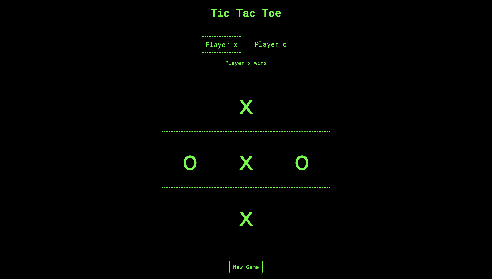

# Tic Tac Toe
Tic Tac Toe game made to practice using factory functions and IIFEs in JavaScript.

Live Preview: https://ninavsworld.github.io/tic-tac-toe/

## How It's Made
**Tech Used:** HTML, CSS, JavaScript

I used flexbox to layout each section of the page, including the gameboard, which was easily laid out using flex-wrap. I utilised IIFEs and factory functions in the JavaScript code to keep it modular and minimise the amount of global variables.

## Lessons Learned
Not really any lessons learned but I suppose that factory functions help to emulate "private" object properties, found in languages such as Java. I still don't fully "get" IIFEs but they made sense in practice as I was coding. I'm not a huge fan of the JS OOP I've learned so far because it feels hacky and, honestly, I'm having a hard time without class-based inheritance, but I recognise it's an important aspect of the language to learn. Hopefully it will click as I continue to learn.

Also, you can't customise the dash sizes of "border-style: dashed" in CSS, which sucks.